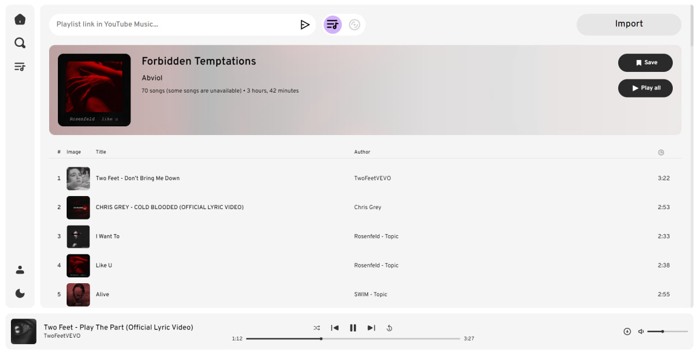
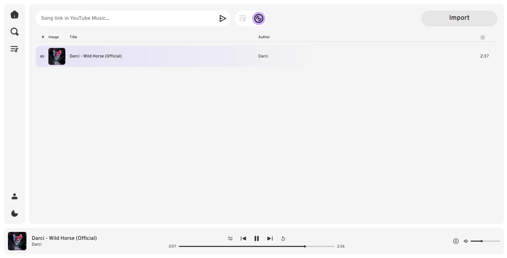
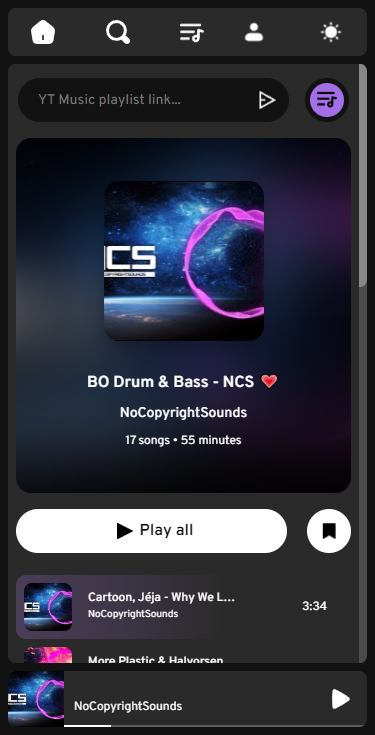
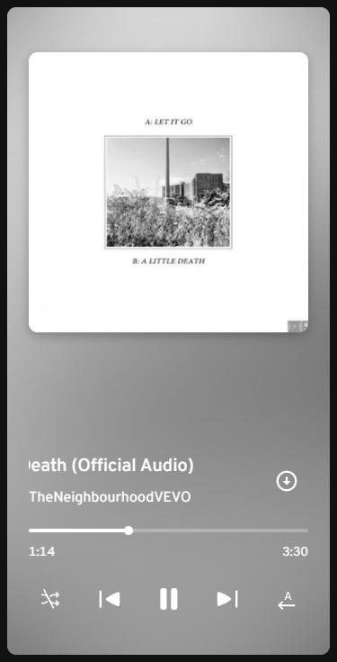

# Melovi - YouTube Music Player And Downloader

    


## Description

A pet project which purpose was to improve my JavaScript skills, learn about working with API requests, here it's YouTube Data API v3, and fill my portfolio.

You can listen to playlists and songs from YouTube Music after just inserting a link for your favourite playlist of songs! There's a bonus side effect – no ads while listening.

It's a demo. The project is supposed to be a Spotify-like web app. See [future features](#future-features).

P.S. I created a new repo on my profile to freely showcase the project with no need to implement it with the .NET framework as on the original one (https://github.com/OleksiyBechke/Melovi).


## Navigation

1. [Description](#description)
1. [Installation and Running](#installation-and-running)
1. [Features](#features)
   1. [App features](#app-features)
   1. [Player features](#player-features)
   1. [Features of the pop-up player for mobile devices](#features-of-the-pop-up-player-for-mobile-devices)
1. [Usage](#usage)
1. [Author's note](#authors-note)
1. [Future features](#future-features)
1. [Screenshots](#screenshots)
1. [Acknowledgements](#acknowledgements)

## Installation and Running

1. Clone the repository.

```bash
git clone https://github.com/Abviol/Melovi.git
```

2. Run the project with the VS Code [Live Server](https://marketplace.visualstudio.com/items?itemName=ritwickdey.LiveServer) plugin.


## Features

#### App features:
- importing playlists and songs by link from YT Music (doesn't work for YT links)
- displaying song data (title, author, image, duration, number in playlist)
- light/dark mode
- responsive design
- Downloading songs in mp3 with a duration of up to 10 minutes

#### Player features:
- displaying song data (title, author, image, duration, current playback time)
- play/pause
- pause on pressing the spacebar
- Playing songs: 
   - To the end of a playlist
   - Loop listening to the whole playlist
   - Loop listening of a single song
- Shuffling songs
- Playing songs
- Volume regulation
- Playback scrolling
- Moving to the beginning/end of a song
- title scrolling if is too long

#### Features of the pop-up player for mobile devices:
- triggered by clicking on the player at the bottom of the screen
- switching playing song to the previous/next one by swiping


## Usage

Insert the link of preferred playlist from YT Music (not YouTube), hit the button, wait and enjoy!

See the video with a showcase [here](https://youtu.be/WUL4MkosYzo).


## Author's note

I chose the music player topic for the project because I love listening to music. I wanted to create something that would allow me to play my favourite songs with my own hands. During the development process, I enhanced my JS skills as I intended, learned how to fetch Google API requests, and how to use YouTube Data API v3. There were lots of troubles due to my lack of experience. I struggled with sequential API requests, playback scrolling, and synchronizing states of the same element in different places. That's only the peak of the iceberg.

Though it is not implemented perfectly, I didn't use best practices but just their pseudo-analogs, the code quality, and the project architecture are poor, I am still proud of it more than of other my apps because I put my soul into it. And I still use it.


## Future features

- user profile
- editing profile settings
- creating, editing, and saving playlists
- user's library consists of liked songs, 100 most frequently played songs, user's own and other users' playlists
- searching playlists and songs through the app's database
- ability to edit songs' data (name, author, image), but the changes are visible only to the editor
- adding songs to the queue (temporary playlist)
- sorting playlists by publishing data, title, author, duration
- liking playlists/songs

Melovi will be rewritten in another framework, most likely in Angular, in order to follow strict development principles, make the project scalable and maintainable.


## Screenshots



 


## Acknowledgements

Thanks to my friends [Bechke Oleksiy](https://github.com/OleksiyBechke), the backend developer, and [Misha Kulkin](https://www.instagram.com/mishakulkin/), the designer, who helped me to release the idea.
